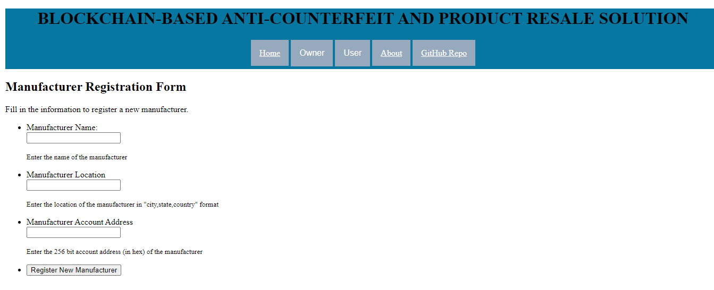

# Forger-No-Forging
This repo is a collection of Solidity Smart Contracts developed for Forger-no-Forging, an Anti-Counterfeit and Product Resale Dapp for Ethereum Blockchain. It consists of `manageProducts.sol` which organizations can use to implement a factory pattern by deploying `productSC` contracts which tokenize products and facilitate transfer of ownership. Additionally, organizations can use `manageManufacturers.sol` to store the manufacturer details on the Ethereum Blockchain.  

## Development dependencies
- NodeJS (make sure you have the latest version of npm, using `npm i -g npm`) 
- Truffle (`npm install -g truffle`) 
- Ganache (http://truffleframework.com/ganache/)
- Metamask browser extension (https://metamask.io/)

## Usage
Run Ganache and Quickstart Ethereum. Then Compile and (locally) Deploy the Smart Contracts as:
 ```
 $ truffle compile
 $ truffle migrate --network development
 ```
To interact with the deployed Smart Contracts, use:
```
$ truffle console
```
You shall immediately see the following prompt:
```
truffle(development)>
```
Now load the instances of your deployed smart contracts using:
```
truffle(development)> let mMInstance = await manageManufacturers.deployed()
truffle(development)> let mPInstance = await manageProducts.deployed()
```
`manageManufacturers.sol` facilitates three functionalities - `owner()`, `registerManufacturer(string, string, address)`, and `manufacturerByAddress(address)`. Use them as you normally would:
```
truffle(development)> mMInstance.owner()
<returns the address of the owner of `manageManufacturers.sol` smart contract>

truffle(development)> mMInstance.registerManufacturer("Manufacturer-Name","Manufacturer-Location", ManufacturerAddress)
<registers the details for a new manufacturer>

truffle(development)> mMInstance.manufacturerByAddress(ManufacturerAddress)
<returns the details of the manufacturer whose address is passed as argument to the function>
```
`manageProducts.sol` facilitates three functionalities - `owner()`, `releaseNewProduct(string, uint256, string, uint256, address)`, and `getProductsInTheMarket()`. Use them as you normally would:
```
truffle(development)> mPInstance.owner()
<returns the address of the owner of `manageProducts.sol` smart contract>

truffle(development)> mPInstance.releaseNewProduct("Product-Name", ProductId, "Product-Description", TotalSupply, ManufacturerAddress)
<deploys a new productSC smart contract which tokenizes a product whose information has been passed as arguments to the function>

truffle(development)> mPInstance.getProductsInTheMarket()
<returns an array for productSC addresses for all tokenized products>
```
To interact with a deployed `productSC` smart contract, obtain its address (say 0x1234...) using `getProductsInTheMarket()` and load its instance as:
```
truffle(development)> let pSCInstance = await productSC.at("0x1234...")
```
`productSC` contracts facilitate three functionalities - `getProductInfo()`, `balanceOf(address)`, and `transfer(address, uint256)`. Use them as you normally would:
```
truffle(development)> pSCInstance.getProductInfo()
<returns details about the tokenized product>

truffle(development)> pSCInstance.balanceOf(EntityAddress)
<returns the amount of tokens (product) that the entity owns, whose address is passed as an argument to the function>

truffle(development)> pSCInstance.transfer(ToAddress, Amount)
<transfers the ownership of tokenized products to the address specified as an argument>
```

## Frontend Website
I'm currently working on making a website for Forger-No-Forging Dapp. It shall make interacting with the Smart Contracts much easier. Here's a screenshot of the progress until now. \
 \
This is just HTML and some CSS, the completed version shall be much more aesthetic :P
